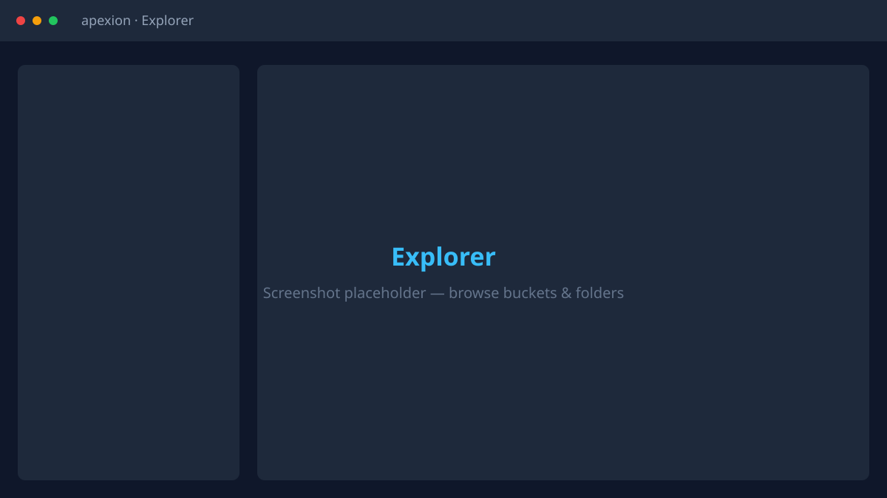
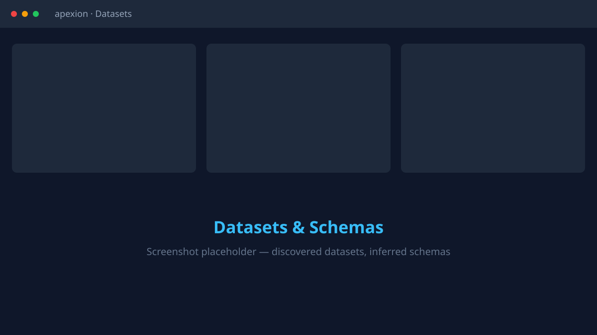
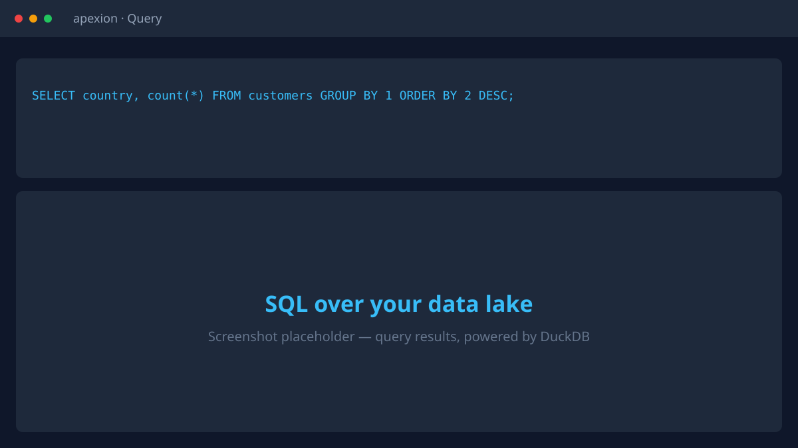

<div align="center">

# Apexion

**Explore, catalog, and query data lakes from a single binary.**

Apexion is a single-binary data lake exploration tool designed to run directly on
an EC2 instance — or any machine with access to object storage. It crawls your
buckets, discovers datasets, infers their schemas, catalogs them into an embedded
[DuckDB](https://duckdb.org) database, and lets you query everything locally with
SQL. No metastore, no cluster, no notebooks — just one executable.

[](https://github.com/cannonkalra/apexion/actions/workflows/ci.yml)
[](https://github.com/cannonkalra/apexion/actions/workflows/release.yml)
[](LICENSE)

</div>

---

## What it does

Point Apexion at an S3-compatible bucket and it lets you:

- 🔎 **Explore S3 buckets** — a fast, VS Code-style browser for your object storage
- 🕸️ **Crawl data lakes** — recursively walk buckets and group objects into datasets
- 🔦 **Search datasets** — filter and find tables across your lake
- 👁️ **Preview files** — inspect CSV, JSON, and Parquet without downloading anything
- 🧬 **Inspect schemas** — automatic schema inference and column-level insights
- 📦 **Import multiple datasets** — bulk-register everything a crawl discovers
- 🗂️ **Register datasets into a DuckDB catalog** — turn raw prefixes into logical SQL tables
- ⚡ **Query everything locally through DuckDB** — read-only SQL, straight over object storage

Everything runs from one process. Drop the binary on an EC2 box next to your data
and open the web UI — no heavyweight infrastructure required.

## Features

- 🧊 **Single self-contained binary** — one file, no runtime dependencies
- 🐹 **Built in Go** — fast, portable, easy to deploy
- 🦆 **Native DuckDB engine** — analytical SQL embedded in the binary
- 🚀 **Fast dataset previews** — sample files in place, no downloads
- 🪣 **Object-store crawling** — walks buckets and prefixes concurrently
- 🔁 **Recursive discovery** — full and incremental crawl modes
- ☁️ **S3-compatible storage** — AWS S3, MinIO, Cloudflare R2, SeaweedFS, and more
- 🧵 **Parallel metadata extraction** — worker pools with rate limiting and checkpointing
- 🗃️ **Dataset cataloging** — persistent catalog of datasets and logical tables
- 🧠 **Schema inference** — types, partitions, and column statistics
- 🔤 **SQL querying** — a read-only SQL scratchpad over your lake
- 💾 **Local DuckDB catalog** — a single `.duckdb` file holds all state
- 🖥️ **Works directly on EC2** — great for IAM instance-profile auth
- 🏔️ **Supports massive data lakes** — cursor pagination and streaming listings
- 🪶 **Zero external services required** — no metastore, no message queue, no cluster
- 📉 **Lightweight deployment** — copy one binary and run

## Architecture

Apexion is a server-rendered web application with an embedded analytical engine:

| Layer | Technology |
| --- | --- |
| Language | **Go** |
| Query engine | **DuckDB** (embedded, via CGO) |
| Views & templates | **[Templ](https://templ.guide)** |
| UI components | **[TemplUI](https://templui.io)** |
| Interactivity | **[HTMX](https://htmx.org)** (modern server-side rendering — no SPA) |
| Storage | pluggable **object-store abstraction** with concurrent crawlers |

The crawler, catalog, and object-store backends are decoupled behind small
interfaces, so storage backends and file-format readers are **pluggable** and
selected at build time.

```
apexion (single binary)
├── web UI + REST API        server-rendered, HTMX
├── crawler                  concurrent discovery, schema inference
├── catalog                  datasets → logical SQL tables
├── DuckDB engine            preview + read-only query, over S3
└── object-store backends    S3 / MinIO / R2 / SeaweedFS / …
        │
        ▼
   your object storage  ──►  local apexion.duckdb catalog
```

## Supported storage

Apexion speaks the S3 API, so it works with:

- **Amazon S3** — including IAM instance-profile / role auth (no static keys on EC2)
- **MinIO**
- **Cloudflare R2**
- **SeaweedFS**
- **Any S3-compatible object store**

Connections support virtual-hosted and path-style addressing, custom regions,
and TLS, and can be added or switched at runtime from the **Settings** page.

### File formats

The default binary reads **CSV/TSV**, **JSON/JSONL**, and **Parquet**. Additional
readers — **Avro**, **ORC**, **Iceberg**, and **Delta Lake** — are experimental
and compiled in via build tags:

```bash
go build -tags "avro,orc,iceberg,delta" ./cmd/apexion
```

First-class support for Iceberg, Delta Lake, and Hudi is on the [roadmap](#roadmap).

## Installation

### Download a binary

Grab the latest build for your platform from the
[**Releases**](https://github.com/cannonkalra/apexion/releases) page and verify it
against `SHA256SUMS`.

**Linux (x86_64)**
```bash
curl -fsSL -o apexion https://github.com/cannonkalra/apexion/releases/latest/download/apexion-linux-amd64
chmod +x apexion && ./apexion version
```

**Linux (arm64)**
```bash
curl -fsSL -o apexion https://github.com/cannonkalra/apexion/releases/latest/download/apexion-linux-arm64
chmod +x apexion && ./apexion version
```

**macOS (Apple Silicon)**
```bash
curl -fsSL -o apexion https://github.com/cannonkalra/apexion/releases/latest/download/apexion-darwin-arm64
chmod +x apexion && ./apexion version
```

**Windows (x86_64)** — download `apexion-windows-amd64.exe` from the Releases page.

### Build from source

Requires **Go 1.26+** and a C toolchain (the DuckDB driver uses CGO).

```bash
git clone https://github.com/cannonkalra/apexion.git
cd apexion
make build          # → ./bin/apexion
./bin/apexion version
```

The generated `*_templ.go` files and compiled CSS are committed, so a plain
`go build ./cmd/apexion` works without the Templ or Tailwind toolchains.

## Quick start

The fastest way to see Apexion in action is the bundled Docker stack — MinIO,
a one-shot seeder that uploads sample datasets, and the app:

```bash
make up      # docker compose up --build
```

Then open **http://localhost:8080**.

Prefer to run it directly against your own storage? Start the server:

```bash
apexion serve
# apexion v0.1.0  ·  data lake exploration, one binary
```

Apexion listens on **http://localhost:8080** by default. Configuration comes from
`configs/apexion.yaml` and/or `APEXION_`-prefixed environment variables — see
[Configuration](docs/configuration.md).

### A five-minute tour

1. **Connect to S3.** Open **Settings → Connections**, add your endpoint,
   region, and credentials (or enable IAM-role auth on EC2), then **Test** and
   **Activate**. On the command line, set `APEXION_MINIO_ENDPOINT`,
   `APEXION_MINIO_ACCESS_KEY`, and `APEXION_MINIO_SECRET_KEY`.

2. **Crawl a bucket.** From the UI wizard, or the CLI:
   ```bash
   apexion crawl warehouse
   apexion crawl warehouse --mode incremental   # only new/changed objects
   ```

3. **Preview data.** Browse the **Explorer**, drill into a prefix, and preview
   any CSV/JSON/Parquet file instantly — Apexion reads it in place, no download.

4. **Register datasets.** From a dataset's page (or the crawl wizard), **Register**
   it as a logical table. Apexion creates a DuckDB view over the underlying files,
   handling Hive and positional partitions for you.

5. **Query with DuckDB.** Open the **Query** page and run read-only SQL:
   ```sql
   SELECT country, count(*) AS n
   FROM customers
   GROUP BY country
   ORDER BY n DESC;
   ```

Everything you register and discover is persisted to a single DuckDB catalog file
(`data/apexion.duckdb` by default).

## Why?

Traditional data-lake exploration is heavy. To answer "what's in this bucket and
what does it look like?" you often stand up a metadata catalog, a crawler service,
a query engine, a notebook server, and the distributed infrastructure to glue them
together — then keep all of it running.

Apexion intentionally avoids all of that. It collapses discovery, cataloging,
preview, and SQL into **one binary** backed by an embedded DuckDB database. You get
an extremely lightweight workflow for understanding a data lake from a single
executable you can run on your laptop or drop straight onto an EC2 instance beside
your data — and delete just as easily when you're done.

## Screenshots

> 📸 Placeholders for now — real captures welcome via PR (see [`docs/screenshots/`](docs/screenshots/)).

| Explorer | Datasets & schemas | SQL query |
| --- | --- | --- |
|  |  |  |

## Roadmap

Apexion is early and moving quickly. Planned work includes:

- 🧊 First-class **Apache Iceberg** support
- 🔺 First-class **Delta Lake** support
- 🌊 **Apache Hudi** support
- 🧭 Column- and table-level **lineage**
- 📝 A richer in-app **SQL editor**
- 📊 **Data profiling** and distribution stats
- 🕸️ **Graph visualization** of datasets and relationships
- 🔄 **Catalog synchronization** with external metastores (e.g. Glue)
- ✅ **Data quality checks** and assertions

Have an idea? [Open an issue](https://github.com/cannonkalra/apexion/issues).

## Documentation

- [Configuration reference](docs/configuration.md)
- [Architecture overview](docs/architecture.md)
- [Contributing guide](CONTRIBUTING.md)
- [Changelog](CHANGELOG.md)

## License

Apexion is released under the [MIT License](LICENSE).
