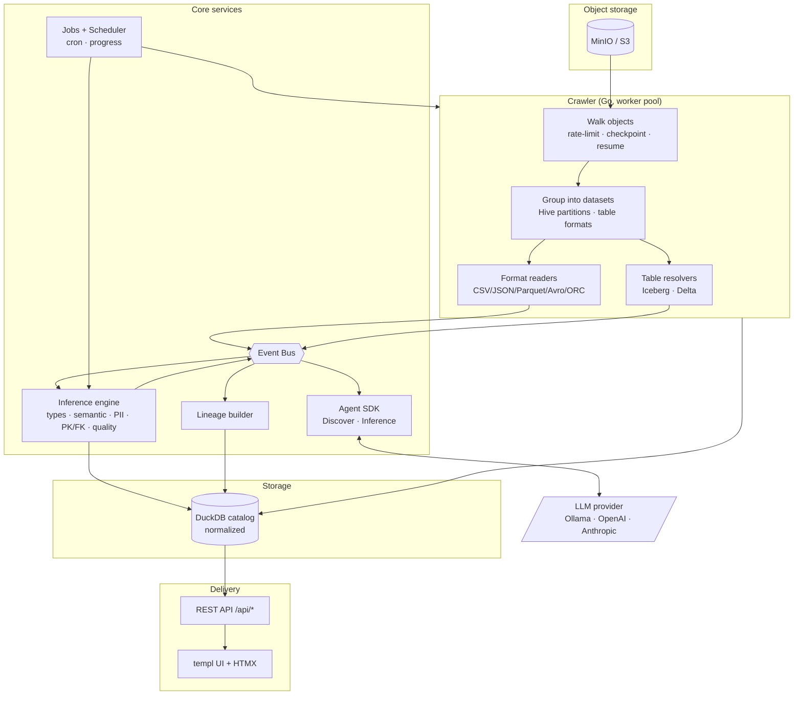
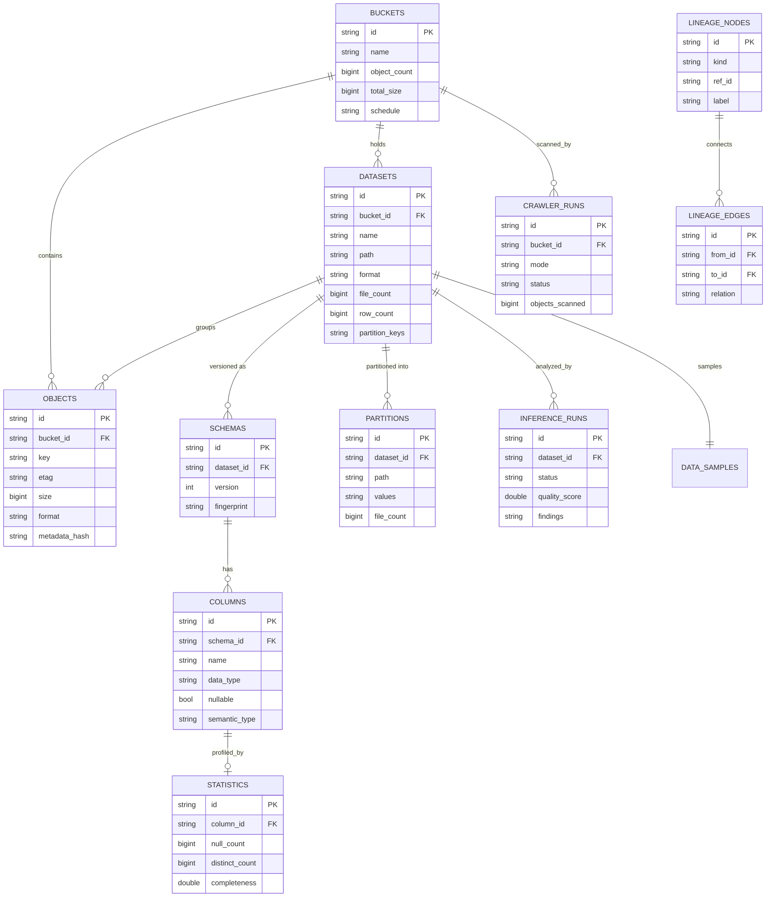

# Apexion

**An open-source, AI-powered data discovery platform — a self-hostable alternative to AWS Glue Data Catalog + Glue Crawlers.**

Apexion crawls object storage (MinIO / any S3-compatible store), discovers datasets, infers schemas and semantic types, detects PII, catalogs everything in an embedded **DuckDB**, and serves a clean, server-rendered dashboard. Its crawler is event-driven, so **AI agents** plug in as event subscribers without touching the crawl path.

```
crawl  →  discover datasets  →  infer schema  →  detect PII / keys  →  catalog  →  REST + UI
                              (events)  →  AI agents (enrich, summarize)
```

- **100% Go** crawler & backend (Go 1.24+, CGO for embedded DuckDB)
- **Server-rendered UI** with **templ**, **HTMX**, **Tailwind** — no React, no Vue, dark mode
- **Formats:** CSV, TSV, JSON, JSONL, Parquet, Avro, ORC, **Iceberg**, **Delta Lake**, Hive partitions
- **Instant preview** — query files *directly from MinIO* with embedded DuckDB (`httpfs`), no download
- **VS Code-style explorer** — browse buckets → folders → files, lazy-loaded
- **SQL scratchpad** — run read-only DuckDB SQL over object storage
- **Cancellable background jobs**, per-directory crawls
- **Event-driven Agent SDK** with pluggable LLMs (offline Ollama, **Groq**, OpenAI/Anthropic)

## Data Explorer & Preview (Phase 1)

Apexion is a **Data Explorer + Data Catalog**, not an ETL tool. The explorer lets you
browse and preview data before (and after) cataloging it:

- **Explorer** (`/explorer`) — a VS Code-style tree over object storage. Click a bucket, drill
  into folders (delimiter-based, lazy), see a live folder summary (files, size, formats, last
  modified), and **Crawl Directory** to catalog just that prefix.
- **Instant file preview** (`/preview`) — opens any CSV/TSV/JSON/JSONL/Parquet file and runs
  `read_csv_auto` / `read_json_auto` / `read_parquet` **directly against `s3://…`** via DuckDB's
  `httpfs` extension. Shows column names, DuckDB types, and 100 sample rows — the file is never
  downloaded. Table-format files (Iceberg/Delta) use `iceberg_scan`/`delta_scan` with a DuckDB S3
  secret.
- **SQL Scratchpad** (`/sql`) — a read-only DuckDB editor. Only `SELECT`, `WITH`, `DESCRIBE`,
  `SUMMARIZE`, `SHOW`, and `EXPLAIN` are permitted (destructive statements are rejected). Every
  dataset has an **Open SQL** button that pre-fills a query over its files.
- **Jobs** (`/jobs`) — background crawl/inference jobs with live progress and a **Cancel** button.
- **Dataset tabs** — Overview, Schema, Files, Partitions, Preview, History, Statistics.

The AI inference now also produces a **business description**, **recommended partition columns**,
**duplicate & missing-value analysis**, a **recommended Apache Doris schema**, and **Spark/Flink
optimization** hints — with **Groq** as a first-class LLM provider (`provider: groq`).

> DuckDB's `httpfs`/`delta`/`iceberg` extensions are auto-installed on first use, which needs
> network once. In a fully offline environment the preview reports a clear message instead of
> failing, and everything else keeps working.

---

## Quick start

### Option A — full stack in Docker (recommended)

```bash
make up          # builds the image, starts MinIO, seeds sample data, starts Apexion
```

Then open **http://localhost:8080**, go to **Buckets**, and click **Scan** on `warehouse`.
(MinIO console: http://localhost:9001 — `minioadmin` / `minioadmin`.)

### Option B — local dev

```bash
# 1. Start MinIO (S3 API on :9000)
docker run -d -p 9000:9000 -p 9001:9001 \
  -e MINIO_ROOT_USER=minioadmin -e MINIO_ROOT_PASSWORD=minioadmin \
  minio/minio server /data --console-address ":9001"

# 2. Seed sample datasets, then run the server
make seed
make run          # http://localhost:8080
```

`make run` regenerates templ + Tailwind and starts the server. The first build compiles the
embedded DuckDB (a few seconds). Everything after that is instant.

### One-off crawl from the CLI

```bash
make crawl BUCKET=warehouse         # or: ./bin/apexion crawl warehouse
```

---

## Architecture



**Event-driven core.** Every meaningful action (`DatasetDiscovered`, `SchemaChanged`, `NewPartition`,
`InferenceCompleted`, `CatalogUpdated`, …) is published on an in-process event bus. Persistence, the
UI activity feed, lineage, and AI agents are all just subscribers — the crawler has no knowledge of them.
This is the extension seam: a new agent or sink is one `bus.Subscribe(...)` call.

---

## Entity model (ER diagram)



Migrations live in [`migrations/`](migrations/) and are embedded in the binary; they run automatically on start.

---

## Project layout

```
cmd/
  apexion/          CLI entrypoint (cobra): serve | crawl | migrate | version
  seed/             sample-data uploader
internal/
  config/           viper configuration
  model/            domain types (shared vocabulary)
  events/           in-process event bus + typed events
  storage/          DuckDB store + repositories
  crawler/          orchestrator (worker pool, checkpoint, incremental)
    s3/             MinIO client + format.Source/Catalog adapters
    format/         reader/resolver interfaces + detection + type inference
    csv/ json/ parquet/ avro/ orc/     file-format readers
    iceberg/ delta/                    table-format resolvers
  inference/        schema/semantic/PII/PK-FK/quality engine
  lineage/          lineage graph builder (event subscriber)
  jobs/             background job manager + cron scheduler
  catalog/          orchestration service (crawl/infer + read models)
  agents/           Agent SDK: providers + DiscoverAgent + InferenceAgent
  api/              REST handlers (chi)
  ui/               templ pages + components + HTMX handlers
  httpserver/       router assembly, middleware, graceful shutdown
  app/              dependency injection & lifecycle
pkg/logger/         zerolog wrapper
migrations/         embedded SQL migrations
assets/             htmx.min.js, compiled Tailwind CSS, favicon (embedded)
configs/            apexion.yaml
```

---

## What the crawler does

- Connects to MinIO and **streams** every object (constant memory — scales to millions).
- **Ignores** hidden/marker files (`.`-prefixed, `_SUCCESS`, `_temporary/…`).
- Detects format by **extension and magic bytes** (`PAR1`, `Obj␁`, `ORC`).
- Groups objects into **datasets**, collapsing folders of same-format files and recognizing
  **Hive `k=v` partitions**.
- Recognizes **table formats**: a `_delta_log/` marks a Delta table; `metadata/*.metadata.json`
  marks an Iceberg table. Their schemas are read from metadata (no data scan).
- **Never loads whole files**: text formats read a bounded byte prefix; Parquet/ORC read only the
  footer via ranged GETs.
- **Worker pool** for parallel schema resolution, optional **rate limiting**, periodic
  **checkpointing** (`--checkpoint_every`), **resume**, and **incremental** crawls via a metadata
  hash of `(etag, size, version, modified)`.

## Inference engine

For a dataset's sampled rows it derives, per column: logical type, **semantic type** (email, phone,
URL, UUID, IP, SSN, credit-card [Luhn], country, currency, language, gender, lat/long, name, address,
zip), **PII flag**, primary-key candidacy, completeness/uniqueness/distinct, min/max, sample values,
and date format. At the dataset level it produces **primary-key** and **foreign-key** candidates
(value-overlap + name affinity) and a **quality score** (completeness · uniqueness · validity ·
consistency).

## AI Agent SDK

Agents are event subscribers with a pluggable LLM backend. Two are shipped:

| Agent            | Trigger               | Action                                                        |
|------------------|-----------------------|---------------------------------------------------------------|
| `DiscoverAgent`  | `DatasetDiscovered`   | Writes a concise dataset description                          |
| `InferenceAgent` | `InferenceCompleted`  | Summarizes findings (PK, PII, quality) in natural language    |

Roadmap interfaces (`QualityAgent`, `LineageAgent`, `DocumentationAgent`) are defined for extension.

The LLM provider is selected by config and works **fully offline** by default (deterministic local
text). To use a real model:

```yaml
agents:
  provider: ollama                       # or openai | anthropic
  llm:
    base_url: http://localhost:11434/v1  # Ollama's OpenAI-compatible endpoint
    model: llama3.1
```

Nothing in the crawler or inference engine changes — the agents just get smarter.

---

## REST API

All endpoints return JSON under `/api`.

| Method & path                         | Description                          |
|---------------------------------------|--------------------------------------|
| `GET  /api/buckets`                   | list buckets                         |
| `POST /api/buckets/{name}/crawl`      | start a crawl (`?mode=incremental`)  |
| `GET  /api/datasets`                  | list datasets (`?bucket_id&format&q`)|
| `GET  /api/datasets/{id}`             | dataset detail (schema, sample, …)   |
| `DELETE /api/datasets/{id}`           | remove a dataset from the catalog    |
| `POST /api/datasets/{id}/infer`       | run inference                        |
| `GET  /api/tables`                    | tables (datasets with a schema)      |
| `GET  /api/schema?dataset_id=`        | latest schema                        |
| `GET  /api/columns?dataset_id=`       | columns + statistics                 |
| `GET  /api/jobs` · `/api/jobs/{id}`   | background jobs & progress            |
| `POST /api/jobs/{id}/cancel`          | cancel a running job                 |
| `GET  /api/runs`                      | crawler run history                  |
| `GET  /api/explorer?bucket=&prefix=`  | browse folders & files (live S3)     |
| `POST /api/directories/crawl`         | crawl a directory (`{bucket,prefix}`)|
| `GET  /api/preview/file?bucket=&key=` | DuckDB preview of a file             |
| `GET  /api/preview/dataset/{id}`      | DuckDB preview of a dataset          |
| `POST /api/sql`                       | run read-only DuckDB SQL (`{sql}`)   |
| `GET  /api/server/buckets`            | live buckets on the connected server |
| `GET  /api/lineage`                   | lineage nodes + edges                |
| `POST /api/infer`                     | run inference (`{"dataset_id": …}`)  |
| `GET  /api/search?q=`                 | global search                        |
| `GET  /api/statistics`                | dashboard metrics + format breakdown |
| `GET  /api/events`                    | recent domain events                 |
| `GET  /api/agents`                    | registered AI agents                 |

---

## Configuration

Defaults live in [`configs/apexion.yaml`](configs/apexion.yaml). Every key is overridable via an
`APEXION_`-prefixed env var (dots → underscores), e.g. `APEXION_MINIO_ENDPOINT`,
`APEXION_CRAWLER_WORKERS`, `APEXION_AGENTS_PROVIDER`.

## Development

```bash
make tools      # install templ + tailwind
make generate   # regenerate *_templ.go
make css        # rebuild Tailwind
make test       # unit + integration tests (uses real DuckDB + generated fixtures)
make vet
```

Generated templ files and the compiled CSS are committed, so `go build ./...` and the Docker image
work without the frontend toolchains.

## Extending Apexion

- **New file format** → implement `format.Reader`, register in `crawler/registry.go`.
- **New table format** → implement `format.TableResolver`, register in `DefaultResolvers()`.
- **New source** (Postgres, Snowflake, GCS, Kafka, …) → the `format.Source`/`format.Catalog`
  interfaces are storage-agnostic; add a new client package alongside `crawler/s3`.
- **New AI agent** → implement `agents.Agent`, subscribe to the events you care about.

## License

MIT.
